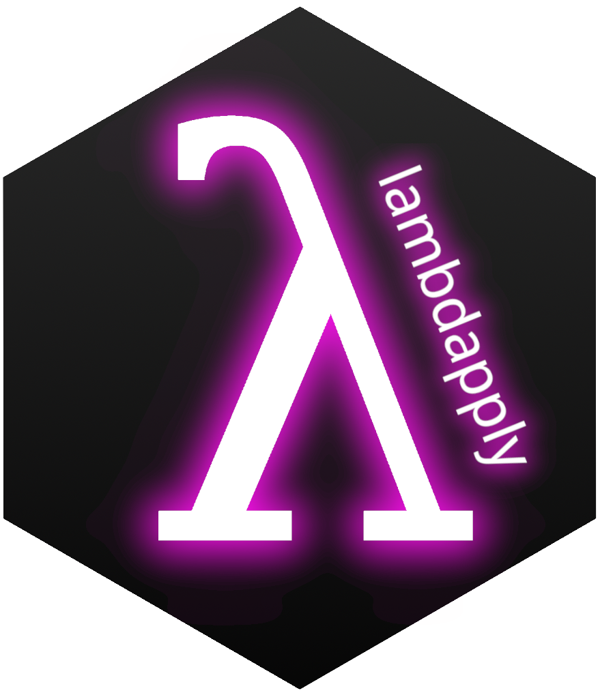

<!-- README.md is generated from README.Rmd. Please edit that file -->

# lambdapply 

<!-- badges: start -->
<!-- badges: end -->

The goal of `lambdapply` is to enable R users to scale their R code
using [AWS Lambda serverless compute
service](https://aws.amazon.com/lambda/), with a familiar \*apply
syntax. Running arbitrary code in AWS Lambda has
[limitations](https://docs.aws.amazon.com/lambda/latest/dg/gettingstarted-limits.html),
and so this package is intended to aid in running code that is
*iterable*. Each iteration needs to be:

-   Independent
-   Short-running
-   Computing across a *small* piece of data

Code those does not meet this criteria will not benefit from scaling
horizontally with AWS lambda. The idea for this package was born from
needing to perform many mutually exclusive function optimisations at
once. Each iteration of the optimisation would only take one minute to
complete, but when executing across many iterations in sequence, the
end-user can wait hours for a result. With this approach, each iteration
can be performed *at the same time* using serverless compute.

## Installation

You can install the development version of lambdapply from
[GitHub](https://github.com/) with:

``` r
# install.packages("devtools")
devtools::install_github("liamgilbey/lambdapply")
```

## Acknowledgements

`lambdapply` would not be possible without the work dedicated to the
following AWS-R packages:

-   [paws](https://github.com/paws-r/paws)
-   [lambdr](https://github.com/mdneuzerling/lambdr)
